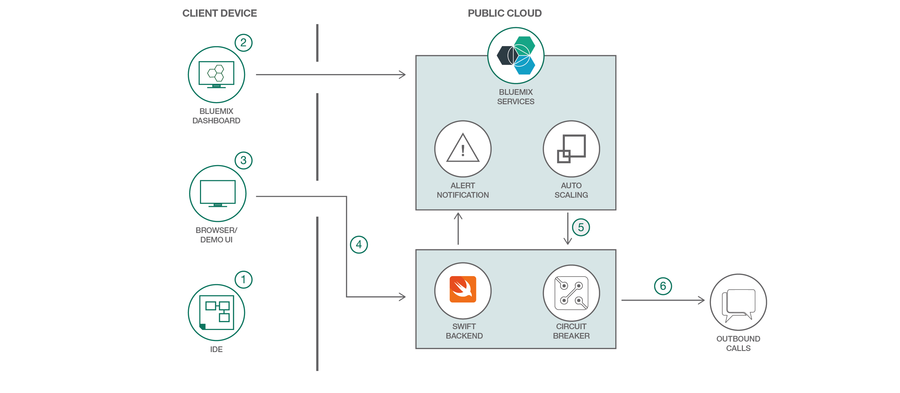
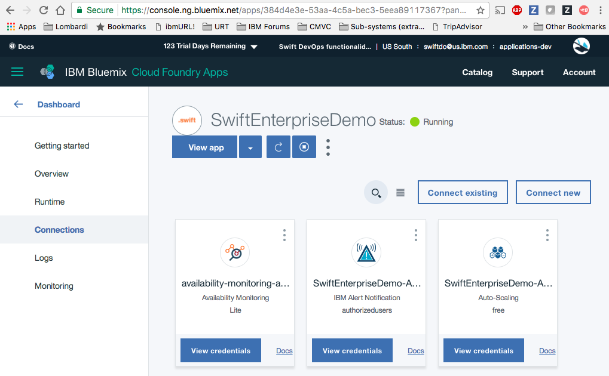
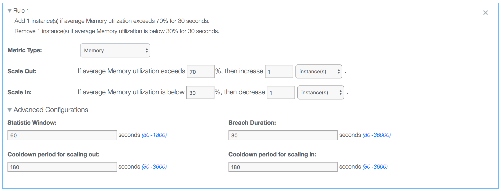
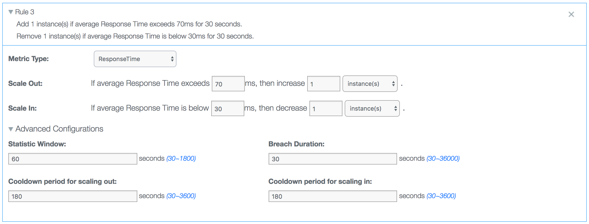
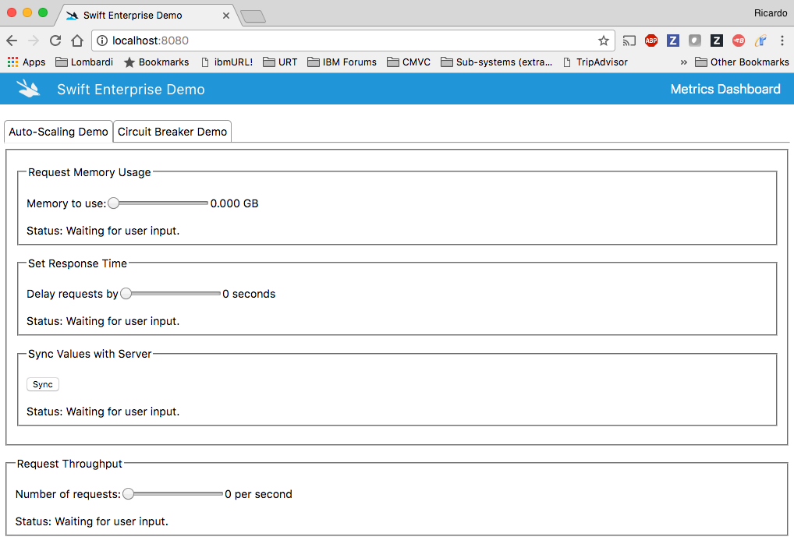
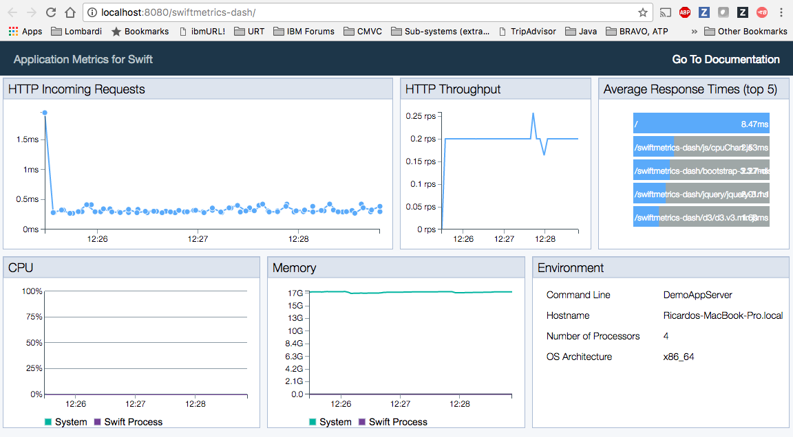

[](https://travis-ci.org/IBM/swift-enterprise-demo)  

# Swift-Enterprise-Demo
O Swift-Enterprise-Demo foi criado para destacar novos recursos corporativos que podem ser usados ao implementar seus aplicativos Swift no Bluemix. Especificamente, este aplicativo apresenta os seguintes serviços e bibliotecas novas do Bluemix para a linguagem Swift:
* Auto Scaling
* Alert Notification
* Circuit Breaker
* SwiftMetrics

Com o Swift-Enterprise-Demo, é possível ver como a escala do aplicativo pode aumentar ou diminuir de acordo com regras definidas no serviço Auto Scaling, receber alertas quando ocorrerem eventos importantes no aplicativo e ver como o padrão do Circuit Breaker impede o aplicativo de realizar ações que obrigatoriamente falharão.

O componente baseado em navegador desse aplicativo fornece widgets de IU que podem ser usados para acionar ações que causarão tensão em seu componente do servidor. Essas ações são capazes de aumentar ou diminuir o uso de memória, aumentar ou diminuir o tempo de resposta HTTP por meio da inclusão ou remoção de um atraso e aumentar ou diminuir o número de solicitações HTTP por segundo.

## Fluxo de Trabalho de Comunicação do Aplicativo

1. O usuário define a configuração para a biblioteca do Circuit Breaker no código antes de implementar o aplicativo no Bluemix (usando o IDE escolhido por ele).
2. Depois de implementar o aplicativo, o usuário cria uma política no Bluemix para configurar os serviços Auto-Scaling e Alert Notification. Essa tarefa é realizada com o painel do Bluemix.
3. O usuário interage com a IU do aplicativo no navegador.
4. Quando o usuário realiza alguma ação, a IU chama o componente de backend do aplicativo Swift.
5. Quando as condições da política de ajuste automático de escala são cumpridas, a escala do aplicativo é ajustada no Bluemix.
6. Em caso de falha em várias solicitações para o terminal configurado para quebra de circuito, a biblioteca do Circuit Breaker é ativada.

## Versão do Swift
A versão mais recente do Swift-Enterprise-Demo funciona com a versão `3.1.1` dos binários do Swift. Para fazer download desta versão dos binários do Swift, clique neste [link](https://swift.org/download/#snapshots).

## Implementando o aplicativo no Bluemix

### Usando o botão Deploy to Bluemix
Ao clicar no botão abaixo, é criada uma cadeia de ferramentas do Bluemix DevOps e esse aplicativo é implementado no Bluemix. O arquivo `manifest.yml` [incluso no repositório] passa por análise sintática para obter o nome do aplicativo, detalhes da configuração e a lista de serviços que devem ser fornecidos. Para ver mais detalhes sobre a estrutura do arquivo `manifest.yml`, consulte a [documentação do Cloud Foundry](https://docs.cloudfoundry.org/devguide/deploy-apps/manifest.html#minimal-manifest).

[](https://bluemix.net/deploy?repository=https://github.com/IBM/swift-enterprise-demo.git&amp;branch=master)

Quando a implementação no Bluemix for concluída, você poderá acessar a rota atribuída ao aplicativo usando o navegador da web que preferir (por exemplo, Chrome, FireFox etc.). Em seguida, deverá ver a página de boas-vindas do aplicativo SwiftEnterpriseDemo.

Observe que o [buildpack do IBM Bluemix para Swift](https://github.com/IBM-Swift/swift-buildpack) é utilizado para a implementação desse aplicativo no Bluemix. No momento, o IBM Bluemix Runtime for Swift é instalado nas regiões do Bluemix a seguir: Sul dos Estados Unidos, Reino Unido e Sydney.
### Usando a linha de comando do Bluemix
Além disso, é possível implementar manualmente o aplicativo Swift-Enterprise-Demo no Bluemix. Apesar de não ser tão mágica quanto usar o botão do Bluemix acima, a implementação manual do aplicativo oferece algumas informações a respeito do que está acontecendo nos bastidores. Lembre-se de que é necessário ter a [linha de comando](http://clis.ng.bluemix.net/ui/home.html) do Bluemix instalada no seu sistema para implementar o aplicativo no Bluemix.

Execute o comando a seguir para clonar o repositório Git:

```bash
git clone https://github.com/IBM/swift-enterprise-demo
```

Acesse a pasta raiz do projeto no seu sistema e execute o script `Cloud-Scripts/cloud-foundry/services.sh` para criar os serviços dos quais o Swift-Enterprise-Demo depende. É necessário efetuar login no Bluemix antes de tentar executar esse script. Para obter informações a respeito de como efetuar login, consulte a [documentação](https://console.ng.bluemix.net/docs/starters/install_cli.html) do Bluemix.

A execução do script `Cloud-Scripts/cloud-foundry/services.sh` deve ter um resultado parecido com este:

```bash
$ Cloud-Scripts/cloud-foundry/services.sh
Creating services...
Invoking 'cf create-service alertnotification authorizedusers SwiftEnterpriseDemo-Alert'...

Creating service instance SwiftEnterpriseDemo-Alert in org roliv@us.ibm.com / space dev as roliv@us.ibm.com...
OK

Attention: The plan `authorizedusers` of service `alertnotification` is not free. The instance `SwiftEnterpriseDemo-Alert` will incur a cost. Contact your administrator if you think this is in error.

Invoking 'cf create-service Auto-Scaling free SwiftEnterpriseDemo-Auto-Scaling'...

Creating service instance SwiftEnterpriseDemo-Auto-Scaling in org roliv@us.ibm.com / space dev as roliv@us.ibm.com...
OK
```

 Após a criação dos serviços, é possível emitir o comando `bx app push` na pasta raiz do projeto para implementar o aplicativo Swift-Enterprise-Demo no Bluemix.

```bash
 $ bx app push
 Using manifest file manifest.yml
 Updating app SwiftEnterpriseDemo in org swiftdo@us.ibm.com / space applications-dev as swiftdo@us.ibm.com...
 OK
 Uploading SwiftEnterpriseDemo...
 Uploading app files from: /home/travis/build/IBM/swift-enterprise-demo
 Uploading 6.9M, 1049 files
 Done uploading
 OK
 Binding service SwiftEnterpriseDemo-Alert to app SwiftEnterpriseDemo in org swiftdo@us.ibm.com / space applications-dev as swiftdo@us.ibm.com...
 OK
 Binding service SwiftEnterpriseDemo-Auto-Scaling to app SwiftEnterpriseDemo in org swiftdo@us.ibm.com / space applications-dev as swiftdo@us.ibm.com...
 OK
 Starting app SwiftEnterpriseDemo in org swiftdo@us.ibm.com / space applications-dev as swiftdo@us.ibm.com...
 Downloading swift_buildpack...
 Downloaded swift_buildpack
 Creating container
 Successfully created container
 Downloading app package...
 Downloaded app package (118.6M)
 Downloading build artifacts cache...
 Downloaded build artifacts cache (13.9M) Staging...
 Exit status 0
 Uploading droplet, build artifacts cache...
 Uploading build artifacts cache...
 Uploading droplet...
 Uploaded build artifacts cache (13.9M)
 -----&gt; Buildpack version 2.0.4
 -----&gt; Default supported Swift version is 3.0.2 -----&gt; Writing profile script...
 -----&gt; Copying deb files to installation folder...
 -----&gt; No Aptfile found.
 -----&gt; Getting swift-3.0.2 Cached swift-3.0.2
 -----&gt; Unpacking swift-3.0.2.tar.gz Uploaded droplet (212.7M) Uploading complete Destroying container
 -----&gt; Getting clang-3.8.0
           Cached clang-3.8.0
 -----&gt; Unpacking clang-3.8.0.tar.xz
 Successfully destroyed container
 -----&gt; .ssh directory and config file not found.
 -----&gt; Skipping cache restore (disabled by config)
 -----&gt; Fetching Swift packages and parsing Package.swift files...
           Cloning https://github.com/IBM-Swift/Kitura.git
           HEAD is now at 44914b5 Unify query string parsing for 'RouterRequest' and 'BodyParser' (#1026)
           Resolved version: 1.6.2

           ...

           Compile CHTTPParser http_parser.c
           Compile CHTTPParser utils.c
           Linking CHTTPParser Compile Swift Module 'HerokuConfig' (1 sources)
           Compile Swift Module 'AmazonConfig' (1 sources)
           Compile Swift Module 'CloudFoundryConfig' (2 sources)
           Compile Swift Module 'KituraRequest' (14 sources)
           Compile Swift Module 'KituraWebSocket' (9 sources)
           Compile Swift Module 'AlertNotifications' (8 sources)
           Compile Swift Module 'SwiftMetricsKitura' (1 sources)
           Compile Swift Module 'SwiftMetricsBluemix' (1 sources)
           Compile Swift Module 'SwiftMetricsDash' (1 sources)
           Compile Swift Module 'DemoAppServer' (10 sources)
           Linking ./.build/release/DemoAppServer
-----&gt; Copying dynamic libraries
-----&gt; Copying binaries to 'bin'
-----&gt; Skipping cache save (disabled by config)
No start command specified by buildpack or via Procfile.
App will not start unless a command is provided at runtime. Uploading droplet...
Uploading build artifacts cache...
Uploaded droplet (212.6M)
Uploading complete
Destroying container
0 of 1 instances running,
1 starting 0 of 1 instances running,
1 starting 1 of 1 instances running
App started
OK
App SwiftEnterpriseDemo was started using this command `DemoAppServer`
Showing health and status for app SwiftEnterpriseDemo in org swiftdo@us.ibm.com / space applications-dev as swiftdo@us.ibm.com...
OK
requested state: started
instances: 1/1
usage: 256M x 1 instances
urls: swiftenterprisedemo-superillustration-spectacular.mybluemix.net
last uploaded: Sun Mar 12 23:39:22 UTC 2017
stack: cflinuxfs2
buildpack: swift_buildpack
   state    since                   cpu    memory        disk         details
#0 running  2017-03-12 11:47:18 PM  0.0%   1M of 256M    247M of 1G
 ```

 Quando o aplicativo estiver em execução no Bluemix, você poderá acessar a URL atribuída a ele (ou seja, rota). Para encontrar a rota, é possível efetuar login na sua [conta do Bluemix](https://console.ng.bluemix.net) ou inspecionar a saída da execução dos comandos `bluemix app push` ou `bx app show <application name>`. A cadeia de caractere exibida ao lado do campo `urls` contém a rota atribuída. Utilize essa rota como a URL para acessar o servidor de amostra com o navegador de sua escolha.

 ```bash
 $ bx app show SwiftEnterpriseDemo
 Invoking 'cf app SwiftEnterpriseDemo'...

 Showing health and status for app SwiftEnterpriseDemo in org swiftdo@us.ibm.com / space applications-production as swiftdo@us.ibm.com...
 OK

 requested state: started
 instances: 1/1
 usage: 256M x 1 instances
 urls: swiftenterprisedemo-superillustration-spectacular.mybluemix.net
 last uploaded: Mon Mar 13 22:50:25 UTC 2017
 stack: cflinuxfs2
 buildpack: swift_buildpack state since cpu memory disk details

#0 running 2017-03-13 11:25:51 PM 0.1% 18.4M of 256M 694.3M of 1G Ricardos-MacBook-Pro:swift-enterprise-demo olivieri$
```

## Configurando o aplicativo Swift-Enterprise-Demo


O arquivo de configuração `cloud_config.json` localizado na pasta raiz do repositório do aplicativo deve ser atualizado antes de você começar a usar o aplicativo.

```bash
$ cat cloud_config.json
{ "name": "SwiftEnterpriseDemo",
 "cf-oauth-token": "<token>",
 "vcap": {
    "services": {
       "alertnotification": [
        {
        "name": "SwiftEnterpriseDemo-Alert",
        "label": "alertnotification",
        "plan": "authorizedusers",
        "credentials": {
           "url": "<url>",
           "name": "<name>",
           "password": "<password>",
           "swaggerui": "https://ibmnotifybm.mybluemix.net/docs/alerts/v1"
         }
       }
      ]
     }
   }
 }
```

### Credenciais para o serviço IBM Alert Notification
Você deve obter as credenciais para a instância de serviço do [IBM Alert Notification](https://console.ng.bluemix.net/docs/services/AlertNotification/index.html) que criou anteriormente e atualizar os valores para os campos `url`, `name` e `password`, de acordo. Para obter essas credenciais, é possível acessar o painel do aplicativo no Bluemix e entrar na página `Connections`:

<p align="center"></p>

### Token de autenticação OAuth do Cloud Foundry

Também é necessário obter um token de autenticação OAuth do Cloud Foundry e atualizar o valor para o campo `cf-oauth-token`. Para obter esse token, é possível executar este comando:
```bash
 $ bx cf oauth-token
 bearer <token string>
```

Não se esqueça de incluir a palavra-chave `bearer` junto com o token quando atualizar o valor do campo `cf-oauth-token` no arquivo `cloud_config.json`.

### Políticas do Auto-Scaling
Por fim, você também deve criar políticas do [Auto-Scaling](https://console.ng.bluemix.net/docs/services/Auto-Scaling/index.html) para utilizar os recursos de ajuste de escala fornecidos por esse serviço. Recomendamos a criação das seguintes regras do Auto-Scaling para o Swift-Enterprise-Demo:

<p align="center"></p>

<p align="center"></p>

<p align="center"></p>

Além disso, o aplicativo Swift-Enterprise-Demo envia alertas com base nas políticas do Auto-Scaling definidas para o aplicativo. Portanto, se nenhuma política estiver definida para o aplicativo, nenhum alerta será enviado.

### Atualizar a instância do aplicativo Swift-Enterprise-Demo em execução no Bluemix
Depois de atualizar o arquivo de configuração `cloud_config.json`, você deve atualizar a instância do aplicativo do Swift-Enterprise-Demo no Bluemix. Para isso, é necessário executar o comando `bx app push` na pasta raiz do repositório do aplicativo.

## Executando o aplicativo localmente
Para desenvolver o aplicativo localmente, utilize o comando adequado dependendo do sistema operacional em execução no seu sistema de desenvolvimento:
* Linux: `swift build`
* macOS: `swift build -Xlinker -lc++`
```bash
$ swift build -Xlinker -lc++
Cloning https://github.com/IBM-Swift/Kitura.git HEAD is now at 44914b5 Unify query string parsing for 'RouterRequest' and 'BodyParser' (#1026) Resolved version: 1.6.2 Cloning https://github.com/IBM-Swift/Kitura-net.git
HEAD is now at 34176a2 Merge the memory leak fixes into master (#176) Resolved version: 1.6.2

Cloning https://github.com/IBM-Swift/LoggerAPI.git HEAD is now at 1e6f08e Perf: Use autoclosures to prevent String construction (#18)
Resolved version: 1.6.0

Cloning https://github.com/IBM-Swift/BlueSocket.git HEAD is now at 32c2dd8 Merge pull request #55 from OhItsShaun/master
Resolved version: 0.12.33
Cloning https://github.com/IBM-Swift/CCurl.git HEAD is now at 3cfb752 Add header callback helper function (#9)
Resolved version: 0.2.3
Cloning https://github.com/IBM-Swift/BlueSSLService.git HEAD is now at 1082e2e Removed the extraneous check for OS. Not required.
Resolved version: 0.12.26
Cloning https://github.com/IBM-Swift/SwiftyJSON.git HEAD is now at 5ca3f00 Merge pull request #30 from IBM-Swift/issue_939
Resolved version: 15.0.5
Cloning https://github.com/IBM-Swift/Kitura-TemplateEngine.git HEAD is now at d876e99 An alternative implementation of PR https://github.com/IBM-Swift/Kitura-TemplateEngine/pull/11 (#12)
Resolved version: 1.6.0
Cloning https://github.com/IBM-Swift/Kitura-WebSocket.git HEAD is now at 727943d IBM-Swift/Kitura#1023 Use ClientResponse instead of HTTPIncomingMessage
Resolved version: 0.7.1
Cloning https://github.com/IBM-Swift/BlueCryptor.git HEAD is now at ed97adc Merge pull request #20 from carlbrown/leakfix
Resolved version: 0.8.8
Cloning https://github.com/IBM-Swift/CommonCrypto.git HEAD is now at 02a5c05 Merge pull request #4 from Bouke/master
Resolved version: 0.1.4
Cloning https://github.com/IBM-Swift/HeliumLogger.git HEAD is now at a6ea950 Regenerated API documentation
Resolved version: 1.6.0
Cloning https://github.com/IBM-Swift/CloudConfiguration.git HEAD is now at a1686aa Added apiURL field to auto-scaling credentials.
Resolved version: 1.1.3
Cloning https://github.com/IBM-Swift/Swift-cfenv.git HEAD is now at 5be2119 Made public fields in Limits structure.
Resolved version: 3.0.2
Cloning https://github.com/IBM-Swift/Configuration.git HEAD is now at 0b41b36 Change load functions to log errors instead of throwing
Resolved version: 0.2.0
Cloning https://d7d10e9fbcfb7eb9c9085927777fcdca9a323586@github.com/IBM-Swift/CircuitBreaker.git HEAD is now at 7ff7310 Merge pull request #23 from IBM-Swift/develop
Resolved version: 0.0.9
Cloning https://github.com/RuntimeTools/SwiftMetrics.git HEAD is now at 3dff821 Merge pull request #72 from sjanuary/graphbug
Resolved version: 0.0.20
Cloning https://github.com/RuntimeTools/omr-agentcore.git HEAD is now at c35de73 Correct CPU timestamp on Mac to msSinceEpoch
Resolved version: 3.1.1
Cloning https://github.com/IBM-Swift/Kitura-Request.git HEAD is now at 2634d14 Updated dependencies
Resolved version: 0.7.0
Cloning https://d7d10e9fbcfb7eb9c9085927777fcdca9a323586@github.com/IBM-Swift/alert-notification-sdk.git HEAD is now at 074af0a Id, not name
Resolved version: 0.1.5
Compile paho src/utf-8.c
Compile paho src/Tree.c
Compile paho src/Thread.c
Compile paho src/StackTrace.c
Compile paho src/SocketBuffer.c
Compile paho src/Socket.c
Compile paho src/MQTTProtocolOut.c
Compile paho src/MQTTProtocolClient.c
Compile paho src/MQTTPersistenceDefault.c
Compile paho src/MQTTPersistence.c

...

Compile Swift Module 'CloudFoundryEnv' (6 sources)
Compile Swift Module 'CircuitBreaker' (2 sources)
Compile Swift Module 'HerokuConfig' (1 sources)
Compile Swift Module 'CloudFoundryConfig' (2 sources)
Compile Swift Module 'AmazonConfig' (1 sources)
Compile Swift Module 'SSLService' (1 sources)
Compile CHTTPParser utils.c
Compile CHTTPParser http_parser.c
Linking CHTTPParser
Compile Swift Module 'KituraNet' (34 sources)
Compile Swift Module 'Kitura' (43 sources)
Compile Swift Module 'KituraRequest' (14 sources)
Compile Swift Module 'KituraWebSocket' (9 sources)
Compile Swift Module 'AlertNotifications' (8 sources)
Compile Swift Module 'SwiftMetrics' (2 sources)
Compile Swift Module 'SwiftMetricsKitura' (1 sources)
Compile Swift Module 'SwiftMetricsBluemix' (1 sources)
Compile Swift Module 'SwiftMetricsDash' (1 sources)
Compile Swift Module 'DemoAppServer' (10 sources)
Linking ./.build/debug/DemoAppServer
```

Antes de executar o executável (ou seja, `DemoAppServer`) para acionar o aplicativo, lembre-se de [configurar](#configuring-the-swift-enterprise-demo-application) o aplicativo.

```bash
$ ./.build/debug/DemoAppServer
[Mon Mar 13 11:28:46 2017] com.ibm.diagnostics.healthcenter.loader INFO: Swift Application Metrics results: []
[2017-03-13T11:28:46.685-05:00] [ERROR] [SwiftMetricsBluemix.swift:116 initCredentials()] [Auto-Scaling Agent] Could not find Auto-Scaling service.
[2017-03-13T11:28:46.690-05:00] [ERROR] [Controller.swift:140 getAutoScalingPolicy()] App is either running locally or an application ID could not be found. Cannot acquire auto-scaling policy information.
[2017-03-13T11:28:50.704-05:00] [INFO] [HTTPServer.swift:88 listen(on:)] Listening on port 8080
```
Depois de iniciar o aplicativo, é possível usar seu navegador de preferência e apontar para `http://localhost:8080/` para acessar a página principal do aplicativo:

<p align="center"></p>

Você precisa estar ciente de alguns pontos:
- Ao executar o aplicativo Swift-Enterprise-Demo localmente, você não poderá utilizar nenhum dos recursos de ajuste automático de escala. Para ver esses recursos em ação, precisará executar o aplicativo no Bluemix.
- Ao executar o aplicativo Swift-Enterprise-Demo localmente, se você clicar no link `Metrics Dashboard`, será levado ao painel do [SwiftMetrics](#swiftmetrics). Se estiver executando o aplicativo de demonstração no Bluemix, ao clicar no link `Metrics Dashboard`, será levado ao painel Bluemix Availability Monitoring.

### SwiftMetrics
Em caso de execução local, é possível acessar o painel do SwiftMetrics clicando no link `Metrics Dashboard`. Ao fazer isso, será aberta uma nova guia no navegador que aponta para esta URL: `http://localhost:8080/swiftmetrics-dash/`. O painel do SwiftMetrics concede acesso a métricas importantes sobre o funcionamento do aplicativo, como o tempo de resposta HTTP médio, o rendimento HTTP, o uso de CPU, o uso de memória e detalhes do ambiente.

<p align="center"></p>

Para obter mais informações sobre o SwiftMetrics, consulte [Métricas do Aplicativo para Swift](https://developer.ibm.com/swift/application-metrics-for-swift/).

## Usando o aplicativo Swift-Enterprise-Demo
Para detalhes a respeito de como usar este aplicativo de demonstração para apresentar os diferentes recursos corporativos disponíveis para aplicativos Swift no Bluemix, preparamos esta série de vídeos:
* [Swift Enterprise Demo - Auto-Scaling](https://youtu.be/-da2e-24DUM)
* [Swift Enterprise Demo - Circuit Breaker](https://youtu.be/QhI0roWWYik)
* [Swift Enterprise Demo - Alert Notifications](https://youtu.be/1VIIY-ija38)

Assista no seu próprio ritmo e aproveite!

# Licença
[Apache 2.0](LICENÇA)
